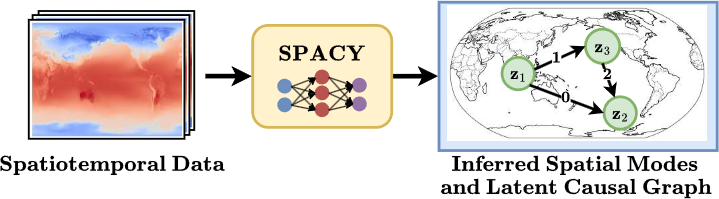

# Discovering Latent Causal Graphs from Spatiotemporal Data

Implementation of the paper "Discovering Latent Causal Graphs from Spatiotemporal Data
", to appear at ICML 2025, Vancouver.

Spatio-Temporal Causal Discovery(SPACY) aims to infer latent causal representation and causal graph that drives the dynamics from spatio-temporal data.

Model Overview

### 1. Prerequisites

*   Python 3.9+
*   conda (recommended)

### 2. Creating the Environment

Create a conda environment and install the dependencies:

    
    conda create -n your-env-name python=3.10
    conda activate your-env-name
    pip install -r requirements.txt
    pip install tigramite;

## Synthetic Experiments

### 1. Data Generation

To generate synthetic data for training, run:

    python -m src.data_generation.generate_data

### 2. Train the Model

To start training the model, use the following command:

    python -m src.train

### 3. Different Settings

To try different synthetic data settings, navigate and modify `configs/data/syn_data_config.yaml` and `configs/data/syn_data_config.yaml`.

You can customize many aspects of synthetic data and model configurations. For example:
- Number of nodes (e.g., 10, 20, 30)
- Functional relationships (e.g., linear, mlp) Note: currently `mlp` functional relationship is only implemented with `hist_dep_noise_type=spline` and `hist_dep_noise=True`
- Map types (e.g., linear, mlp)
- Single or multi-variate data (num_variates=1 or num_variates>1)
    

You can also chose to include settings in the command line. For example, to run an synthetic experiment with linear SCM and non-linear spatial mapping, run the following command for data generation:

    python -m src.data_generation.generate_data \
    data_config.model=spacy \
    data_config.nx=100 \
    data_config.ny=100 \
    data_config.node_dist=10 \
    data_config.node_extent_high=6 \
    data_config.node_extent_low=3 \
    data_config.functional_relationships=linear \
    data_config.num_variates=1 \
    data_config.base_noise_type=gaussian \
    data_config.hist_dep_noise_type=none \
    data_config.hist_dep_noise=False \
    data_config.noise_scale=0.5 \
    data_config.map_type=mlp \
    data_config.num_nodes=10;

and run the following command for training:

    python -m src.train \
    data.data_config.model=spacy \
    model=SPACY \
    data=synthetic \
    data.data_config.nx=100 \
    data.data_config.ny=100 \
    data.data_config.node_dist=10 \
    data.data_config.node_extent_high=6 \
    data.data_config.node_extent_low=3 \
    data.data_config.functional_relationships=linear \
    data.data_config.num_variates=1 \
    data.data_config.base_noise_type=gaussian \
    data.data_config.hist_dep_noise_type=none \
    data.data_config.hist_dep_noise=False \
    data.data_config.noise_scale=0.5 \
    data.data_config.map_type=mlp \
    data.data_config.num_nodes=10 \
    random_seed=0;

## Acknowledgement
We implemented some parts of our framework using code from [Project Causica](https://github.com/microsoft/causica). 

The data generation process is partially inspired by [SAVAR](https://github.com/xtibau/savar)